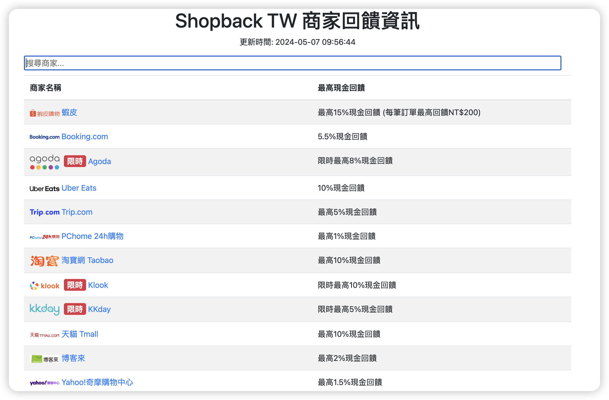

# Shopback TW 商家資訊
使用 Python flask X bs4 X requests 做出來的小網站，可以讓人一眼看出目前有回饋的商家跟回饋比例。

原網站：https://www.shopback.com.tw/all--stores，為什麼要做這個......可能是因為覺得爬蟲很有趣吧 XD
## 程式預覽

## 程式功能
- 可以一次性列出目前所有有回饋的商家（並帶有超連結導回 Shopback 和商家 Logo）以及現金回饋資訊，並且每 10 分鐘自動更新一次
- 可以使用商家名稱或現金回饋價格比例進行排序
- 允許快速搜尋商家名稱
## 使用說明
安裝必要套件後，直接執行 `shopback_cashback_rate.py` 即可，之後可利用 http://localhost:5000 連線到網站